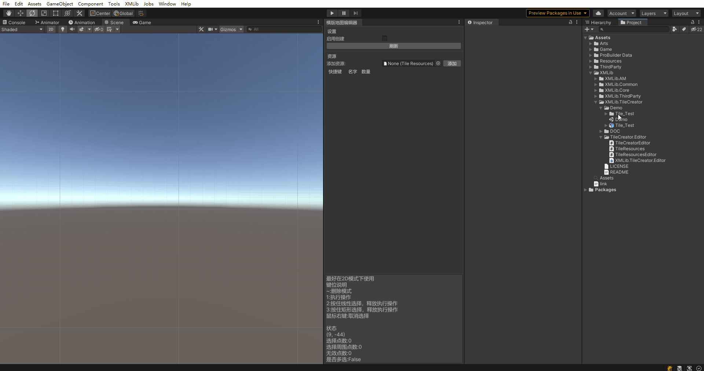
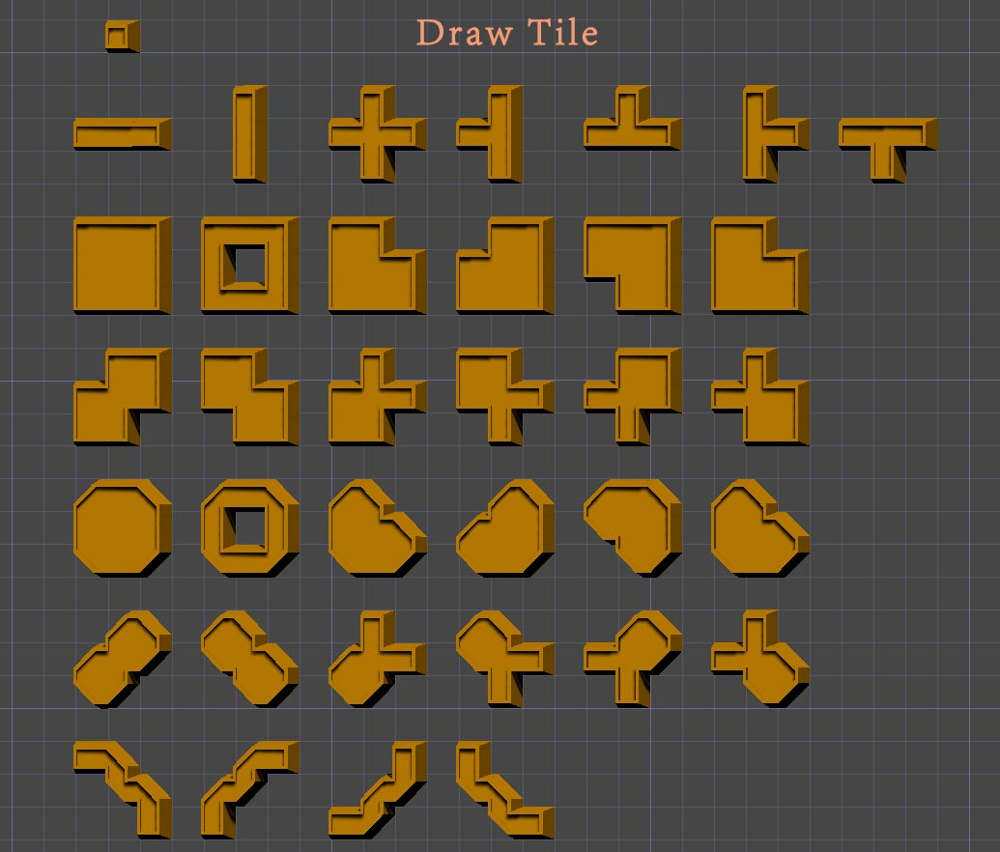

# XMLib 瓷砖编辑器

- 基于坐标计算，可用于横板2D或3D场景
- 生成场景可分层
- 支持1/20/55种方块模式

## 演示

## 支持瓷砖样式及其命名

## 瓷砖组合样式

## 依赖

## 技术交流

<a target="_blank" href="https://qm.qq.com/cgi-bin/qm/qr?k=GxcUh67h3QvklZYNcv_DN3p0xk5WTw_b&jump_from=webapi">
群名称：游戏开发交流
群号：1147265945
</a>